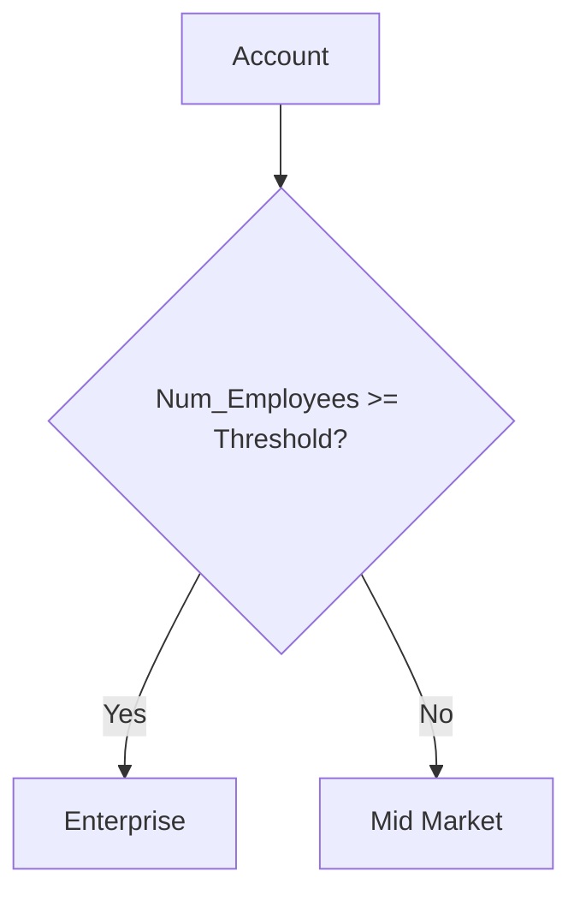
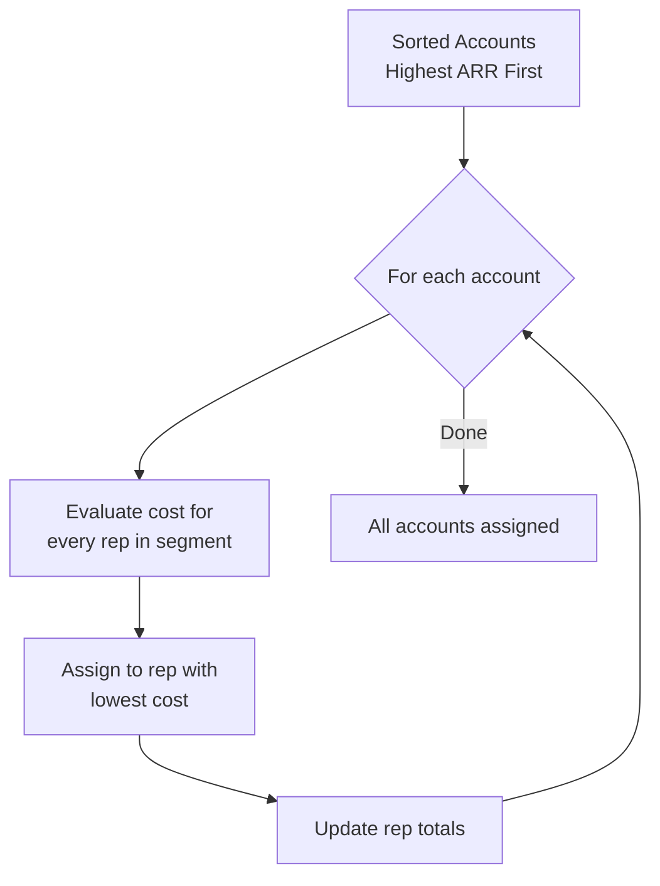
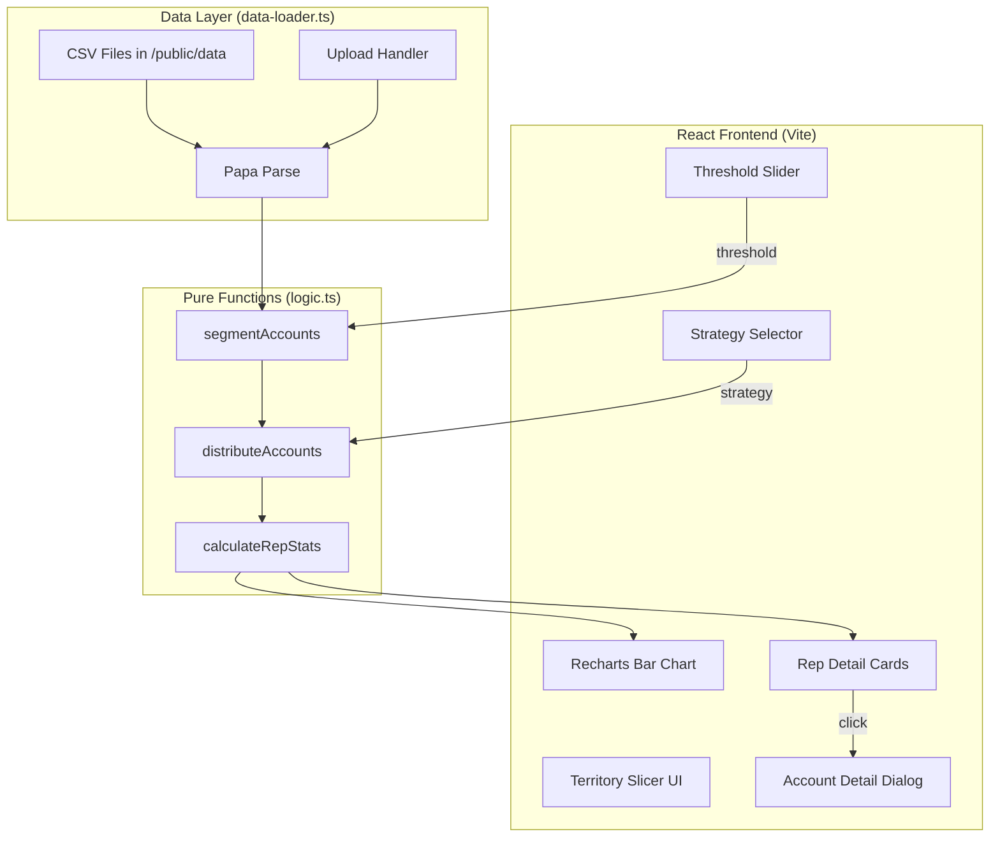

# Territory Slicer — Logic & Architecture

## Overview

The Territory Slicer helps sales leadership find the "sweet spot" for splitting accounts
between **Enterprise** and **Mid-Market** segments by toggling an employee-count threshold
and instantly seeing how territory assignments redistribute.

---

## Data Pipeline

```mermaid
flowchart LR
    A[CSV Files<br/>Reps + Accounts] -->|Papa Parse| B[Parsed Arrays<br/>Rep[] + Account[]]
    B -->|segmentAccounts| C[Segmented Accounts<br/>Enterprise / Mid-Market]
    C -->|distributeAccounts| D[Assigned Accounts<br/>Each has Assigned_Rep]
    D -->|calculateRepStats| E[Rep Statistics<br/>ARR, Count, Risk, Geo]
    E --> F[Charts + Metrics<br/>UI Render]
```

### Steps

1. **Load** — CSV files are fetched and parsed with `Papa Parse`. Numeric columns
   (`ARR`, `Num_Employees`, `Risk_Score`) use `dynamicTyping: true` to convert
   strings to numbers during parse.

2. **Segment** — `segmentAccounts(accounts, threshold)` tags each account as
   `Enterprise` (employees >= threshold) or `Mid Market` (employees < threshold).

3. **Distribute** — `distributeAccounts(segmented, reps, strategy)` separates
   accounts and reps into their respective segment pools, then runs the chosen
   strategy on each pool independently.

4. **Aggregate** — `calculateRepStats()` rolls up per-rep totals for
   ARR, account count, high-risk count, and same-state count.

5. **Render** — React `useMemo` recomputes everything when threshold or strategy
   changes. Recharts bar chart and metric cards update instantly.

---

## Segmentation Logic



- The threshold is a single number (configurable via slider from 500 to 200,000).
- `>=` is used for the boundary (an account at exactly the threshold is Enterprise).
- Changing the threshold re-segments ALL accounts and triggers redistribution.

---

## Distribution Strategies

All strategies share a common pattern: **sort accounts by ARR descending, then
assign each account to the rep with the lowest "cost."** The cost function is what
differs between strategies.



### Strategy 1: Pure ARR Balance

```
cost(rep) = rep.currentTotalARR
```

This is the **Longest Processing Time (LPT)** heuristic for the multiprocessor
scheduling problem. By always assigning the largest remaining account to the
lightest-loaded rep, it achieves near-optimal ARR balance.

**Guarantee**: For k reps, the max/min ARR ratio is at most (4/3 - 1/3k).

### Strategy 2: ARR + Risk Balance

```
cost(rep) = rep.currentTotalARR + riskAdjustment
```

Where riskAdjustment (only applied for high-risk accounts, Risk_Score > 70):
- **+8% of avgARRPerRep** if rep already has >40% high-risk accounts (penalty)
- **-4% of avgARRPerRep** if rep has <20% high-risk accounts (bonus)

The asymmetric penalty/bonus (8% vs 4%) prioritizes **preventing risk
concentration** over perfectly even risk distribution.

### Strategy 3: ARR + Geographic Clustering

```
cost(rep) = rep.currentTotalARR - geographyBonus
```

Where:
- **geographyBonus = 15% of avgARRPerRep** if account.Location == rep.Location

The bonus is scaled relative to average book size so it influences assignment
without completely overriding ARR balance. This reduces travel costs and
supports relationship-building in local markets.

### Strategy 4: Smart Multi-Factor

```
cost(rep) = rep.currentTotalARR
           + workloadPenalty
           - geographyBonus
           + riskAdjustment
```

| Factor | Adjustment | When |
|--------|-----------|------|
| Workload | +6% of avgARRPerRep | Rep has >110% of target account count |
| Geography | -10% of avgARRPerRep | Account in same state as rep |
| Risk (high) | +5% of avgARRPerRep | High-risk account + rep has >40% high-risk |
| Risk (low) | -3% of avgARRPerRep | High-risk account + rep has <20% high-risk |

All adjustments are **scaled relative to the dataset's average ARR per rep**,
ensuring proportional influence regardless of dataset size or ARR magnitude.

---

## Why This Approach Is Sound

### 1. Greedy Bin Packing is Proven
The LPT heuristic for multiprocessor scheduling is a well-studied algorithm
with known performance bounds. It's used in production scheduling, cloud
computing resource allocation, and load balancing.

### 2. Scaling Adjustments Proportionally
The original implementation used fixed dollar amounts ($150K, $100K, etc.) for
adjustments. This is fragile — if the dataset has different ARR ranges, the
adjustments either dominate or become irrelevant.

The improved implementation scales all adjustments as percentages of average
book size:
- Small enough to not override ARR balance (max 15%)
- Large enough to meaningfully influence assignment decisions
- Automatically adapts to any dataset

### 3. Segment Isolation
Enterprise accounts are only distributed among Enterprise reps, and Mid-Market
among Mid-Market reps. This is critical because:
- Reps have different skill sets and relationships
- Mixing segments would defeat the purpose of segmentation
- Each pool is independently optimized

### 4. Edge Case Handling
- Empty segment pools (all accounts in one segment) don't crash
- Zero-ARR accounts are handled correctly
- Single-rep segments assign all accounts to that rep
- Identical ARR values distribute evenly by count

---

## Metrics Explained

| Metric | Formula | Interpretation |
|--------|---------|---------------|
| **ARR Std Dev** | Standard deviation of totalARR across active reps | Lower = more balanced revenue distribution |
| **Workload Range** | Max accounts - Min accounts across active reps | Lower = more even account distribution |
| **Same-State %** | (In-state accounts / Total accounts) * 100 | Higher = better geographic clustering |
| **Risk Balance** | Std Dev of high-risk percentage across active reps | Lower = more even risk distribution |

---

## Architecture



### Key Design Decisions

- **All computation is client-side** — No backend API calls needed. The Express
  server only serves static files.
- **`useMemo` for reactivity** — Recomputes only when threshold or strategy
  changes, keeping the UI responsive.
- **Pure functions** — `segmentAccounts`, `distributeAccounts`, and
  `calculateRepStats` are all pure functions with no side effects, making them
  easy to test and reason about.
- **CSV as source of truth** — No database needed. Upload new CSVs to instantly
  re-run analysis on different datasets.

---

## File Map

| File | Purpose |
|------|---------|
| `client/src/lib/logic.ts` | All algorithms: segmentation, distribution, stats |
| `client/src/lib/data-loader.ts` | CSV loading, parsing, validation |
| `client/src/components/territory-slicer.tsx` | Main UI: slider, charts, metrics |
| `client/src/components/rep-accounts-dialog.tsx` | Drill-down modal per rep |
| `client/src/components/dataset-manager.tsx` | CSV upload interface |
| `client/src/lib/__tests__/logic.test.ts` | 40+ test cases covering all strategies |

---

## Test Coverage

The test suite validates:

1. **Segmentation** — Threshold boundaries, edge values, empty input
2. **All 4 strategies** — Account assignment, ARR preservation, segment isolation
3. **Edge cases** — Empty pools, single rep, zero ARR, skewed data
4. **Equity invariants** — Total ARR preserved, no duplicates, ARR ratio < 2x
5. **Threshold scenarios** — Moving threshold up/down, all thresholds work without errors

Run tests with: `npm test`
